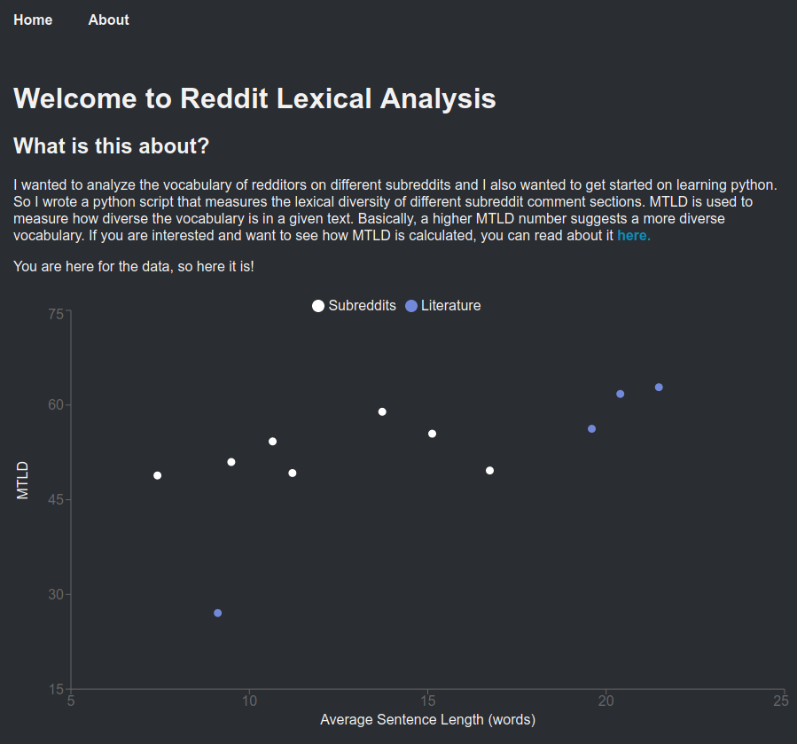

# Reddit Vocab Static

## Overview

A simple static site that shows the lexical diversity of different subreddits and literature texts. The python script used to analyze each subreddit's comments can be accessed [here](https://github.com/moa-novae/reddit_vocab)

## Screenshot

## Details

This is built with React-static and written in TypeScript. Recharts is used to display graphical data.
